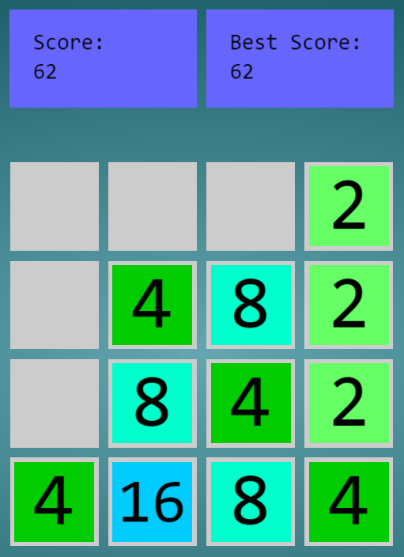

# 2048

2048 clone written in javascript with [Three.js](http://threejs.org/).

- Text made with [Threex.dynamictexture](https://github.com/jeromeetienne/threex.dynamictexture) extension

Live [Demo](http://polygone.xyz/2048/) 

#Controls

← Left Arrow — MOVE LEFT 

→ Right Arrow — MOVE RIGHT 

↑ Up Arrow — MOVE UP 

↓ Down Arrow— MOVE DOWN 

[ENTER] — RESET GAME

# Todo

- Add Sounds
- Mobile Touch/Controls
- Game Over Sequence